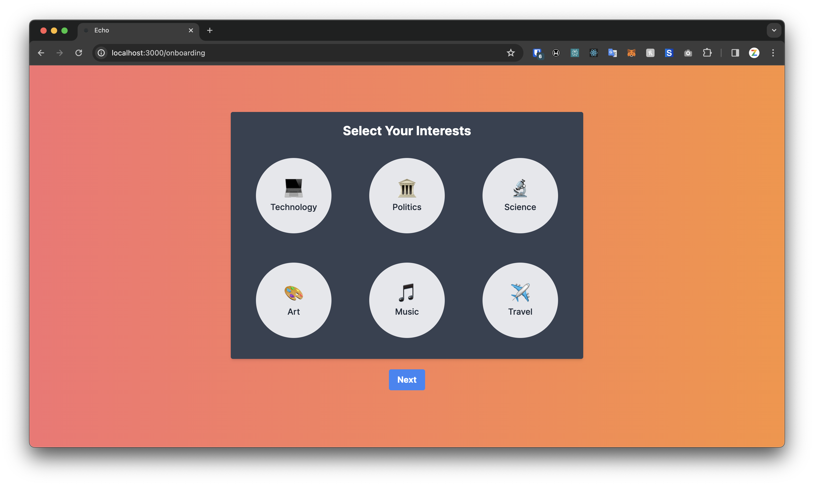
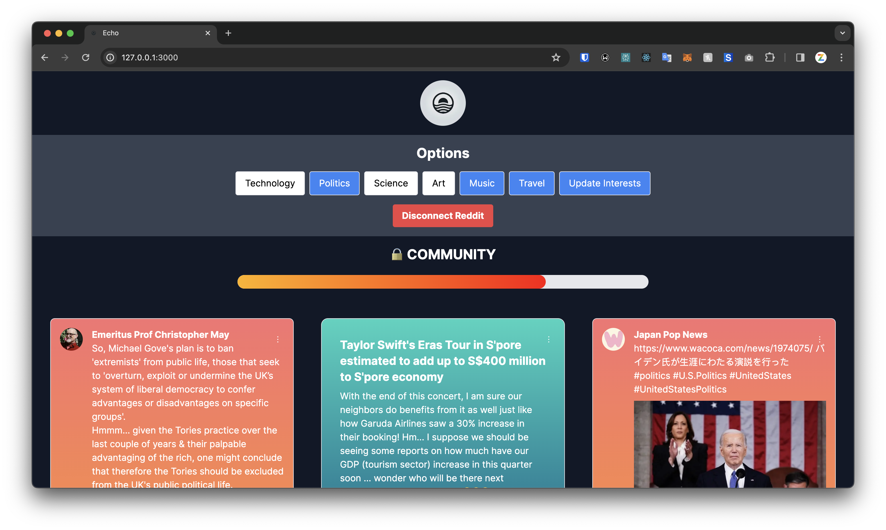

# Echo

## Video Pitch

[YouTube Link](https://youtu.be/G6QvBej8fCU)

## The Problem

Social media used to be social. Nowadays, it's a battleground for attention, with algorithms deciding what we see and when we see it. This has led to a situation where we are constantly bombarded with content that we don't care about, and we are missing out on the content that we do care about. This is a problem that we are solving with Project ECHO.

## Solution: ECHO
ECHO is a web3 social media aggregator platform that helps disillusioned users gain control of their own feed algorithms through "finding their people." Users connect their social media platforms and explicitly select their interests, and ECHO aggregates content across these platforms to create a customized feed.

Users engage with the content by marking what they like or dislike, enhancing the app's understanding of their preferences. This process not only refines their feed over time but also earns them tokens and progresses them towards unlocking an exclusive community feature. 

The community aspect is at the heart of ECHO, connecting users with others who share similar interests and values. This feature ensures that users not only see content that aligns with their preferences but also discover enriching content that broadens their horizons.

## Codebase

| Title | Link | Description |
| :---- |:---- | :---------- |
| Web application | [Link](https://github.com/ECHO-LONDON/ECHO-Web) | Full-stack webapp written in Next.js. Select interests, connect Reddit & Mastodon, and unlock Echo Community. |
| Solana smart contract | [Link](https://github.com/VenroyDEV/ECHO-BACKEND) | Smart contract to reward users of ECHO for reviewing data.
| Datasets | [Link](https://github.com/ECHO-LONDON/ECHO-DATASETS) | Datasets used for finetuning the LLM. |
| Embeddings | [Link](https://github.com/ECHO-LONDON/ECHO-Embeddings) | Finding closeness between topic and text embeddings. |
| Filecoin | [Link](https://github.com/ECHO-LONDON/ECHO-Filecoin-FVM) | Implementation of Filecoin for ECHO. |

## User Profile
The user of ECHO will typically be a disillusioned individual who:

1. Spends lots of time everyday doom-scolling on social media,
2. Is aware of its detrimental effects on his or her mental health,
3. Can't help himself from doing so (maybe tried to stay away from social media but didn't work), and
4. Wants to make a positive change

## Full Technical User Flow

## Challenge - Best AI Use Case for Gaming, Social or Digital Entertainment

At its heart, ECHO seeks to revolutionize the way we interact with social media. By leveraging AI, we are able to provide users with a personalized feed that is tailored to their interests, and to connect them with others who share similar interests.

### Use Case of AI
Simply: take back control control of your attention

When the user creates an account with ECHO, our algorithm takes the user's feed from selected sources (Tik Tok, Instagram, Twitter) to build an INITIAL understanding of the user's profile. This initial user profile reflects the digital image of the user in the eyes of the social media giants - The user himself has no control over this digital image.

Through giving feedback to the ECHO algorithm on what kind of content he wants to see, the user helps to finetune the model and persoanlise his digital user profile. This ECHO user profile will gradually grow to reflect not just the user's true image of himself, but his IDEAL image - hence slowly helping him to become his ideal social media self.

## Challenge - AI Solutions for Emerging Tech Industries
ECHO addresses a salient painpoint, so the main questions to ask in terms of its web3 implementations are:
1. Why implement ECHO as a Web3 social media app instead of a Web2 one?
2. Why build on Solana?
3. How does implementing ECHO as a Solana dapp benefit Solana?

### Why Web3:
**User-Ownership:** ECHO positions itself as a platform that gives control of algorithms back to the users. Instead of running the risk of being seen as another Web2 social media giant wannabe, ECHO is more of a social media upstart that prioritises value of user-ownership and user-control through utilising Web3 & blockchain technology (Solana for main UX, Filecoin for file storage).

### Why Solana:
1. **Technical feasibility:** Solana optimises for speed and scalability (low-cost, high throughput transactions) which are necessary for the successful implementation of any large-scale consumer app (Solana has ~0.4s blocktime which is faster than L2s like Polygon (2s) - Latency in UX cannot be perceived as easily)
2. **Proven track record:** Successful past implementations of such consumer apps on the Solana blockchain such as StepN
3. **Existing network effect:** High user and developer activities on Solana, in particular for NFTs and entertainment
4. **Expanding ecosystem of consumer-focused app:** Trends enabled by (1) (2) and (3) positions Solana as the go-to blockchain for Web3 entertainment; Potential to leverage Web3 *composability* to the fullest to develop a seamless consumer user experience following developments of complementary consumer dapps

### Why deploying ECHO on Solana may be beneficial to the Solana ecosystem:

**Onboarding Web2 users:** ECHO positions itself as a “gateway” app for web2 consumers through handling custodial wallet creation (Similar to Brave Wallet); abstracts away Web3 complexities in the design of UX

**Alleviating negative perception:** By positioning ECHO as a social media with a good cause, a successful implementation of ECHO would serve well to alleviate the negative perceptions around Solana consumer apps as epitomised by projects like StepN

------
### Tokenomics
#### Fungible Token: $ECHO (Reference: Reddit Coins)
$ECHO will be the core protocol token in ECHO. We have decided against making it tradable on the secondary market as doing so introduces an incentive for farming - hence making it counterproductive given ECHO's emphasis on harnessing intrinsic over extrinsic motivations (user gives feedback to better curate his or her feed algorithm, not to get money). The Tokenomics of $ECHO comes can be understood in terms of its demand and supply:
(Refer to Technical User Flow for more details)

**$ECHO's Demand:**

Utilities in ECHO Communities:

1. Weighted votes in voting for community events
2. "Trending" posts in community feed determined by weighted share of $ECHO tokens
3. Spend $ECHO to customise avatar, get new skins (Reference: Discord)
4. Spend $ECHO to obtain limited edition sticker packs (Reference: Discord)

Governance (After Staking $ECHO:

1. Have a say in major changes in ECHO community
2. Participate in content moderation in ECHO community
3. Have a say in directing future developments in ECHO ecosystem

**$ECHO's Supply:**

Distribution:

1. Token reward for fine-tuning model through feedbacks given
2. Airdrops to early supporters (eg. Beta testers, social media influencers)

Supply:

- Fixed supply
- Fair-launched, minted when users provide meaningful feedback for fine-tuning
- Decay overtime: early users get more $ECHO per feedback

#### Non-Fungible Tokens (Reference: Reddit Badges, Lens Protocol profiles & architecture)
While the ability to "find their people" provides a ready source of intrinsic motivation for users, NFTs makes the community experience more fun through a certain degree of gamification. 

In the early implementation of ECHO, NFTs come in 3 forms:

1. Badges (reference: Reddit contribution badges)
2. Mural Board (reference: BAYC bathroom wall)
3. Avatar customisations (eg. hats, sunglasses, etc)

Badges can be earned through active and meaningful engagement with the community (eg. join/host community online events such as Friday Poetry Night on live voice channel - referencing Discord events).
Bades (+$ECHO) unlocks access to community mural board, where users can add pixels to co-create an art-work which will be saved as an NFT (Doesn't have to be an art-work. If, say, the community loves aesthetic quotes and poetry etc, this collective piece can even be a communal poetry collection)
Users can exchange $ECHO for avatar customisations. Limited edition customisations (eg. santa hat) can be obtained during special periods/events/accomplishments

In the long-term when there is more of a thriving consumer dapp ecosystem on Solana, NFTs can be leveraged together with composability of blockchain networks to enable seamless and magical user experience. Users can possibly take their avatars to other social medias/ consumer dapps while retaining their social graph etc.

## Challenge - Most promising AI x Web3 Build Using Filecoin

Utilising Filecoin, our project leverages the localnet Filecoin Virtual Machine (FVM) for smart contracts, to enhance data proofing processes. Our solution leverages Filecoin for secure "Customer preference" storage and in the future complete customer profile, employing cryptographic practices for data allows for security for sensitive data related to users. As a result, Filecoin allows for the storing of a pre-processed customer dataset ready to be utilised on a machine learning model to identify profile similarities for our "community tab". This approach not only ensures privacy and security but also enables personalised user experiences. All this is based on data users provide us about their views on certain content allowing us to build a clustering model from the data we store on Filecoin.

The pre-processing system before upload is yet to be decided due to not having all parameters we want to store yet. However, when storing the data onto the blockchain we leverage Lighthouse as a median to easily instruct the FVM on the files and to extract relevant information and parameters required. In the future, have the process fully streamlined and secured in all stages via encryption and without utilising a "middle-man" like lighthouse. The tracking of file progress and publishing in this case was all done through "boost" the local host. Once published, if deals are established, Lassie Fetch mechanism was used to retrieve files but a very specific variation that considers peer-to-peer networks due to being on localnet.

Our project illustrates a comprehensive understanding of Filecoin, addressing real-world challenges with innovative solutions. Our social media aggregator filters content to deliver relevance, enhancing user interaction and feedback processes, with data securely stored on Filecoin. Our team's expertise, coupled with a clear business model, positions us for impactful execution, demonstrating our project's potential through a concise and compelling pitch.
